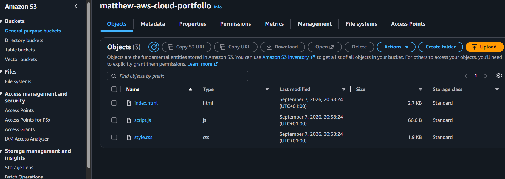
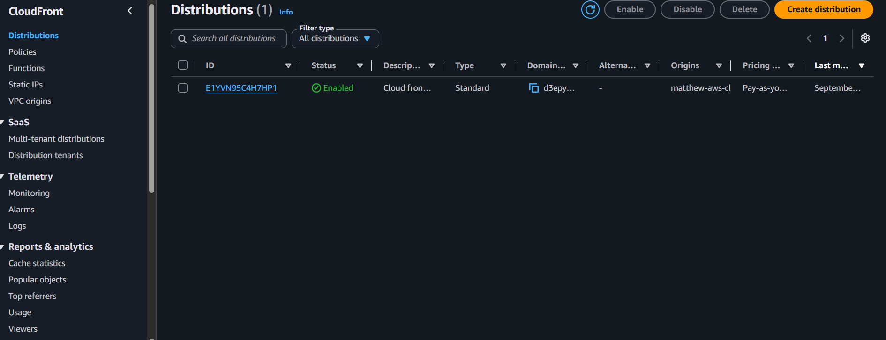
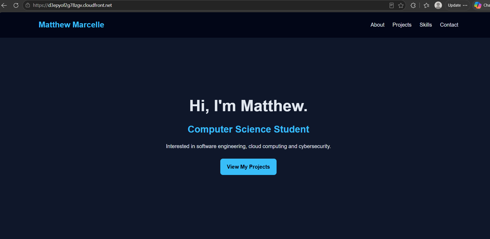

# AWS Cloud Portfolio

A personal portfolio website built with HTML, CSS and JavaScript and deployed on Amazon Web Services (AWS).

## 🌐 Live Website

https://d3epyof2g78zgv.cloudfront.net

## ☁️ AWS Architecture

User → Amazon CloudFront → Private Amazon S3 Bucket

The website files are stored in an Amazon S3 bucket and delivered securely to users through Amazon CloudFront.

## 🛠️ Technologies Used

- Amazon Web Services (AWS)
- Amazon S3
- Amazon CloudFront
- HTML
- CSS
- JavaScript
- Git
- GitHub

## 🔐 Cloud & Security

- Configured an Amazon S3 bucket to store the static website files.
- Kept the S3 origin private rather than exposing the bucket directly.
- Configured Amazon CloudFront to deliver the website over HTTPS.
- Worked with AWS permissions and IAM while configuring the deployment.
- Used Git and GitHub for source-code management.

## 📸 Deployment Evidence

### Amazon S3

The website files deployed to my Amazon S3 bucket.

### Amazon CloudFront

CloudFront distribution used to securely deliver the website.

### Live Website

The completed portfolio running through the CloudFront distribution.

## 📚 What I Learned

Through this project I gained hands-on experience with AWS cloud services, including deploying static web content, configuring S3 and CloudFront, managing cloud permissions and troubleshooting deployment issues.

This project helped me understand how cloud storage and content delivery services can work together to deploy a secure and accessible web application.
